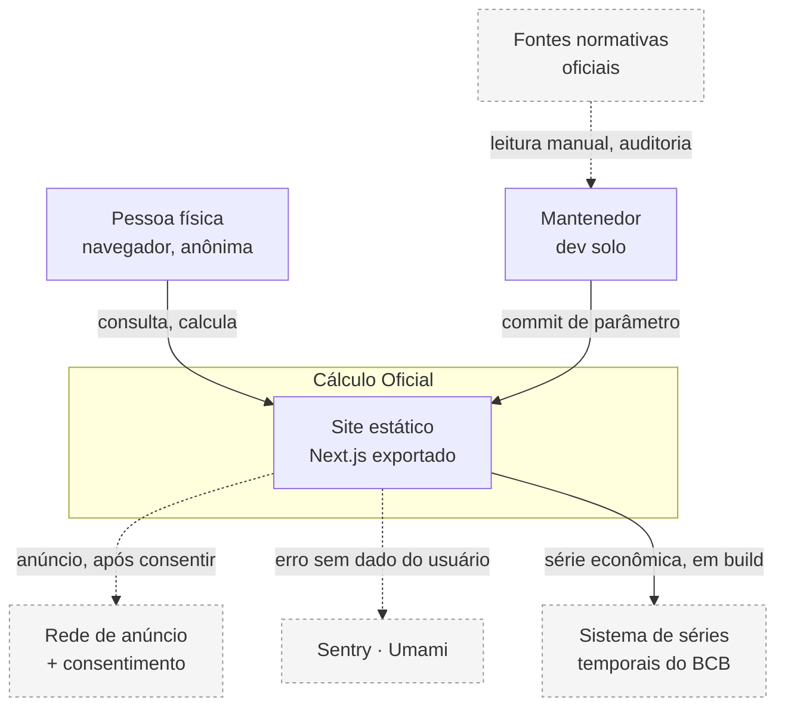
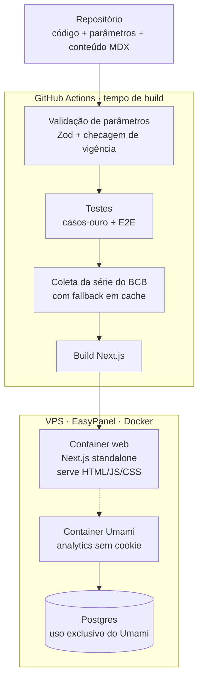
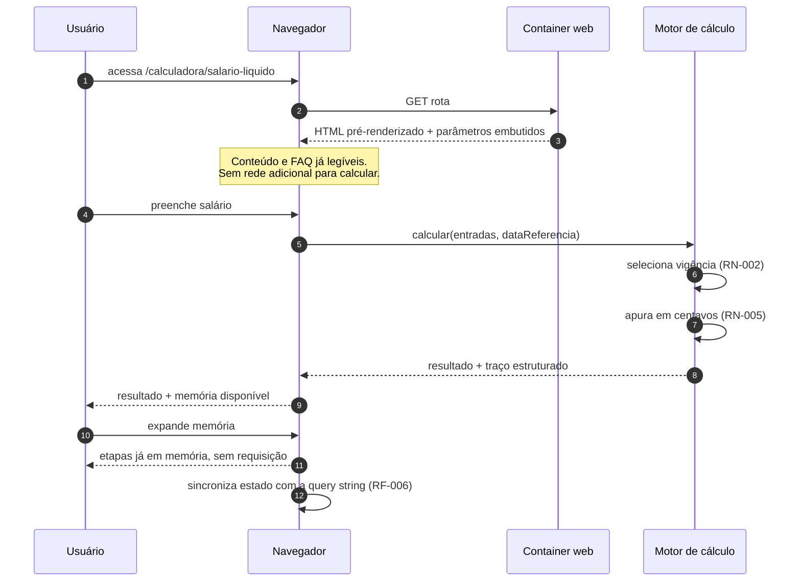
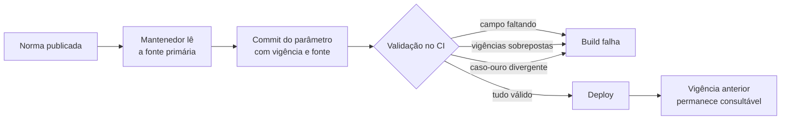

# Arquitetura

## 1. Princípio orientador

O produto é um **site estático com um motor de cálculo puro embarcado**. Não há servidor de aplicação, não há banco de dados e não há estado de usuário. Todo parâmetro legal é código versionado, validado no build.

Essa decisão elimina, de uma vez, autenticação, migração de schema, backup de dados de usuário, superfície de injeção, latência de rede no cálculo e custo variável de infraestrutura. O custo é a ausência de qualquer funcionalidade que dependa de estado — aceito conscientemente no v1 e registrado em `ADR-002`.

## 2. Diagrama de contexto

**Legenda.** Linha cheia: dependência de funcionamento. Linha tracejada: dependência degradável — a falha reduz receita ou observabilidade, nunca a funcionalidade. As fontes normativas não são integração: são processo humano de auditoria.

## 3. Diagrama de containers

> 📌 PREMISSA: o Postgres do diagrama serve **exclusivamente** ao Umami e é dependência da ferramenta de análise, não da aplicação. A aplicação não conhece esse banco e continua funcionando integralmente se ele cair. Isso não contradiz `ADR-002`.

## 4. Camadas e stack

| Camada | Tecnologia | Papel | Justificativa |
|---|---|---|---|
| Parâmetros legais | Módulos TypeScript + Zod | Fonte de verdade das constantes | Diff auditável no histórico do repositório; mudança de tabela é revisão de código, não edição silenciosa em banco (`ADR-001`) |
| Motor de cálculo | Pacote TypeScript puro, sem dependência de runtime | Cálculo e geração do traço | Testável isoladamente; portável para servidor no futuro sem reescrita (`ADR-003`) |
| Aritmética | Inteiros em centavos | Precisão monetária | Ponto flutuante produz divergência de centavos contra o holerite (`ADR-004`) |
| Apresentação | Next.js App Router, geração estática | Rotas, SEO, renderização | Produto vive de busca orgânica |
| Estilo | Tailwind + shadcn/ui | Sistema visual e componentes acessíveis | Acessibilidade sem manter biblioteca própria |
| Conteúdo | MDX no repositório | FAQ e guias | Conteúdo versionado junto do código, sem componente novo de infraestrutura |
| Estado de formulário | Estado local do componente + sincronização com a query string | Entrada e permalink | Entrega "salvar cálculo" sem banco (`RF-006`) |
| Série econômica | Coleta em build + revalidação incremental | Sugestão de taxa | Nunca bloqueia renderização (`ADR-006`) |
| Hospedagem | VPS + EasyPanel + Docker | Execução | Já existente; custo marginal nulo |
| Observabilidade | Sentry + Umami autohospedado | Erro e uso | Umami dispensa banner adicional e mantém a promessa de privacidade (`ADR-005`) |

## 5. Fluxo de uma requisição

**Consequência de latência.** O caminho crítico do cálculo tem zero saltos de rede. `RNF-005` (≤ 50ms) é uma decorrência da arquitetura, não uma otimização.

## 6. Fluxo do parâmetro legal

Nenhum parâmetro chega à produção sem passar por `RN-001`, `RN-002` e pela suíte de casos-ouro. Vigência antiga nunca é sobrescrita — é encerrada com `vigencia_fim` e permanece disponível para cálculo retroativo (`RF-004`).

## 7. Decisões de estado e cache

| Estado | Onde vive | Persistência |
|---|---|---|
| Entradas do formulário | Memória do componente + query string | Enquanto a aba existir, ou pela URL salva |
| Data de referência | Query string | Idem |
| Parâmetros legais | Bundle da aplicação | Até o próximo deploy |
| Série econômica | Valor embutido no build + revalidação incremental diária | Último valor conhecido, com data |
| Consentimento de anúncio | Armazenamento local do navegador, gerido pela plataforma de consentimento | Até revogação |
| Qualquer valor digitado pelo usuário | **Em lugar nenhum além da sessão do navegador** | Nunca sai do dispositivo (`RN-030`) |

## 8. Jobs assíncronos

Não há fila nem worker. As duas tarefas periódicas do sistema são:

| Tarefa | Onde roda | Frequência | Falha significa |
|---|---|---|---|
| Revalidação da série econômica | Revalidação incremental na própria aplicação | Diária | Valor exibido envelhece; sinalizado ao usuário após 30 dias (`RN-033`) |
| Auditoria de parâmetros contra fonte oficial | **Processo humano**, agendado | Trimestral e a cada virada de exercício | Risco de cálculo desatualizado — ver `12-test-plan` e `15-runbook` |

A segunda é a mais importante do projeto e é deliberadamente humana: nenhuma automação lê norma jurídica de forma confiável.

## 9. Limites conhecidos e ponto de quebra

| Limite | Valor estimado | O que acontece ao ultrapassar |
|---|---|---|
| Requisições servidas pela VPS | Ordem de milhares por minuto para conteúdo estático | Antes de quebrar, degrada latência. Mitigação: colocar CDN à frente — não exige mudança de código |
| Tamanho do bundle de parâmetros | Cresce linearmente com anos de vigência × calculadoras | Com muitas vigências, carregar apenas a vigência selecionada por rota, sob demanda |
| Número de calculadoras | O build cresce com o catálogo | Acima de ~40 rotas, avaliar geração sob demanda em vez de estática total |
| Escrita concorrente de parâmetros | Um mantenedor | Não é limite técnico: é limite de processo. Dois mantenedores exigem revisão obrigatória por par |

**Ponto de quebra real.** Não é técnico. É a auditoria: acima de aproximadamente 25 calculadoras com parâmetro versionado (`Fonte = P` no catálogo), um mantenedor solo não consegue mais auditar tudo a cada virada de exercício sem degradar `M-3`.

**O catálogo cruza esse limite na fase v4.** Contagem derivada da coluna `Fonte` de `00-catalogo-calculadoras` §4 a §13:

| Fase | Calculadoras com parâmetro | Acumulado |
|---|---|---|
| v1 | 9 | 9 |
| v2 | 7 | 16 |
| v3 | 8 | **24** |
| v4 | 5 | **29** |

Até o fim de v3 o catálogo cabe dentro do limite, com folga de uma calculadora. A fase v4 o ultrapassa em quatro.

**Consequência.** A abertura de v4 não é uma decisão de escopo como as anteriores: exige, antes, uma das três saídas — reduzir o conjunto de v4 com parâmetro (as nove exceções de `00-catalogo-calculadoras` §17 são as candidatas naturais, cinco delas em v4), descontinuar calculadoras de fases anteriores cuja manutenção não se pagou (regra 7 de §16), ou deixar de ser um projeto de mantenedor solo. O número a observar é o tempo de auditoria por trimestre registrado em `14-observability` §8, não a contagem de calculadoras — a contagem é só o indicador antecedente.

## 10. Estratégia de evolução

**Se o tráfego dobrar:** nada muda. Conteúdo estático escala por CDN.

**Se a hipótese HIP-02 se confirmar e houver demanda por conta de usuário:** adiciona-se Postgres + Better Auth + persistência de cálculo. O motor de cálculo não muda uma linha, porque é puro e não conhece persistência. Custo de reversão da `ADR-002` estimado em 5 a 8 dias-dev.

**Se o catálogo passar de 40 calculadoras:** o motor de parâmetros passa a ser carregado por rota e por vigência, em vez de embutido inteiro. Mudança localizada na camada de carregamento.

**Se surgir necessidade de exportação em PDF:** geração no cliente, mantendo a arquitetura. Só migra para servidor se exigir marca d'água controlada — o que só faz sentido com produto pago.

**O que deliberadamente não está previsto:** microserviços, orquestração de contêiner, fila de mensagens, cache distribuído, banco vetorial, camada de IA. Nenhum deles resolve um problema que este produto tem.
