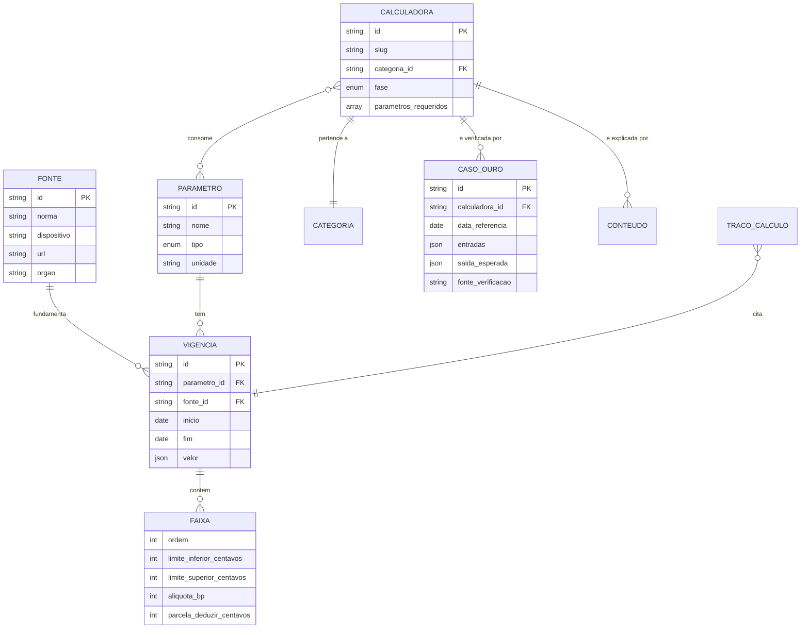

# Modelo de Dados

## 1. Escopo e natureza

Não há banco de dados (`ADR-002`). O modelo descrito aqui é implementado como **estruturas TypeScript versionadas no repositório**, validadas por Zod no build.

A ausência de SQL não torna o modelo menos rigoroso. Pelo contrário: as restrições que um banco imporia em tempo de execução são impostas aqui em tempo de build, onde falham antes de chegar ao usuário.

**Correspondência de conceitos:**

| Conceito relacional | Equivalente neste projeto |
|---|---|
| Tabela | Coleção tipada exportada por módulo |
| Constraint | Schema Zod + verificação customizada no build |
| Índice | Estrutura de busca construída em memória na inicialização |
| Migração | Commit no repositório, com histórico do Git como trilha de auditoria |
| Chave estrangeira | Referência tipada, verificada pelo compilador |
| Auditoria | Histórico do Git: quem, quando, o quê, com qual justificativa |

## 2. Diagrama de entidades



**Legenda.** `TRACO_CALCULO` não é armazenado: é produzido em memória a cada cálculo e descartado ao fim da sessão. Aparece no diagrama porque cita vigências, e essa citação é o que sustenta `RF-003`.

## 3. Entidades

### ENT-001 — `Fonte`

Origem normativa de um parâmetro. **Nenhum parâmetro existe sem fonte** (`RN-001`).

| Campo | Tipo | Obrigatório | Restrição |
|---|---|---|---|
| `id` | string | sim | Único; `kebab-case`; nunca reciclado |
| `norma` | string | sim | Identificação da norma |
| `dispositivo` | string | não | Artigo, inciso, anexo |
| `url` | string | sim | URL absoluta, **de domínio oficial** |
| `orgao` | enum | sim | Órgão emissor |

**Regra de integridade F-1.** `url` deve pertencer a domínio governamental oficial. URL de blog, software de terceiro ou site concorrente reprova o build. Este é o mecanismo que impede a fonte de erro mais provável do projeto: copiar tabela de quem também copiou.

### ENT-002 — `Parametro`

Definição do que é uma constante legal, independentemente do valor.

| Campo | Tipo | Obrigatório | Restrição |
|---|---|---|---|
| `id` | string | sim | Único; nunca reciclado |
| `nome` | string | sim | Nome exibível ao usuário na memória de cálculo |
| `tipo` | enum | sim | `tabela_faixas` · `valor_monetario` · `percentual` · `inteiro` · `mapa` · `fracao` |
| `unidade` | enum | sim | `centavos` · `basis_points` · `fracao_exata` · `dias` · `horas` · `adimensional` |

**Sobre `fracao`.** Constante legal multiplicativa que não cabe em basis points é registrada como `{ numerador, denominador }`, ambos inteiros, **sem simplificar** — a forma da norma, não a reduzida (`ADR-007`, regra F-2). Basis points continua sendo o padrão; `fracao` é exceção, e usá-la onde `bp` serve é ruído.
| `descricao` | string | sim | Uma linha explicando o que representa |

### ENT-003 — `Vigencia`

**Entidade central do sistema.** Um valor de parâmetro válido em um intervalo de tempo.

| Campo | Tipo | Obrigatório | Restrição |
|---|---|---|---|
| `id` | string | sim | Único |
| `parametro_id` | ref | sim | Deve existir |
| `fonte_id` | ref | sim | Deve existir (`RN-001`) |
| `inicio` | date | sim | Data de início da vigência |
| `fim` | date \| null | não | `null` = vigente indefinidamente (`RN-004`) |
| `valor` | json tipado | sim | Formato conforme `Parametro.tipo` |
| `observacao` | string | não | Particularidade de aplicação |

**Restrições:**

| # | Regra | Falha em |
|---|---|---|
| V-1 | Não pode haver duas vigências do mesmo parâmetro cobrindo a mesma data (`RN-002`) | Build |
| V-2 | `fim`, quando presente, é posterior a `inicio` | Build |
| V-3 | No máximo uma vigência por parâmetro com `fim = null` | Build |
| V-4 | O formato de `valor` corresponde ao `tipo` do parâmetro | Build |
| V-5 | Vigência publicada **nunca é editada para corrigir valor** — ver §6 | Revisão |

**Lacunas são permitidas e são informação.** Se não há vigência cobrindo determinado período, o cálculo é bloqueado com mensagem explícita (`RN-003`). Uma lacuna sinaliza honestamente "não sabemos"; uma extrapolação silenciosa produziria um número errado com aparência de certo.

### ENT-004 — `Faixa`

Linha de uma tabela progressiva. Existe apenas dentro de uma `Vigencia` do tipo `tabela_faixas`.

| Campo | Tipo | Obrigatório | Restrição |
|---|---|---|---|
| `ordem` | int | sim | Sequencial a partir de 1 |
| `limite_inferior_centavos` | int | sim | ≥ 0 |
| `limite_superior_centavos` | int \| null | sim | `null` na última faixa |
| `aliquota_bp` | int | sim | Alíquota em pontos-base (basis points) |
| `parcela_deduzir_centavos` | int | não | Quando a tabela usa parcela a deduzir |

**Restrições:**

| # | Regra |
|---|---|
| FX-1 | As faixas de uma vigência são contíguas: o limite inferior de cada faixa é igual ao superior da anterior mais um centavo |
| FX-2 | Não há sobreposição nem lacuna entre faixas |
| FX-3 | A última faixa tem `limite_superior_centavos = null`, ou a vigência declara teto explícito |
| FX-4 | Alíquotas em basis points para evitar decimal: 7,5% é `750` |

### ENT-005 — `Calculadora`

Metadado de cada calculadora do catálogo.

| Campo | Tipo | Obrigatório | Restrição |
|---|---|---|---|
| `id` | string | sim | `CALC-NNN`, conforme o catálogo |
| `slug` | string | sim | Único; parte da URL; **nunca alterado após publicação** |
| `nome` | string | sim | — |
| `categoria_id` | ref | sim | Uma das 10 categorias |
| `fase` | enum | sim | `v1` · `v2` · `v3` · `v4` |
| `parametros_requeridos` | ref[] | sim | Determina a cobertura de vigência necessária |
| `guia_slug` | ref | não | Conteúdo associado |
| `relacionadas` | ref[] | sim | 2 a 4 calculadoras |

**Restrição C-1.** `parametros_requeridos` define, por transitividade, o intervalo de datas de referência aceito pela calculadora: é a interseção das vigências disponíveis de todos os parâmetros exigidos. Esse intervalo é calculado no build, não escrito à mão.

**Restrição C-2.** Alterar um `slug` publicado exige redirecionamento permanente registrado. URL indexada que quebra destrói o único canal de aquisição do produto.

### ENT-006 — `CasoOuro`

Caso de verificação conferido contra fonte oficial. Detalhado em `12-test-plan`.

| Campo | Tipo | Obrigatório |
|---|---|---|
| `id` | string | sim |
| `calculadora_id` | ref | sim |
| `data_referencia` | date | sim |
| `entradas` | json | sim |
| `saida_esperada` | json | sim |
| `fonte_verificacao` | string | sim |
| `observacao` | string | não |

**Restrição CO-1.** `fonte_verificacao` descreve **como** o resultado esperado foi obtido: conferência manual contra o texto da norma, exemplo publicado em fonte oficial, ou holerite real anonimizado. Caso-ouro cujo valor esperado veio de outro site é inválido e não entra no repositório.

### ENT-007 — `Conteudo`

Guia ou FAQ em MDX.

| Campo | Tipo | Obrigatório |
|---|---|---|
| `slug` | string | sim |
| `tipo` | enum | sim — `guia` · `faq` |
| `calculadoras_relacionadas` | ref[] | sim |
| `titulo`, `resumo` | string | sim |
| `atualizado_em_versao` | string | sim |

### ENT-008 — `TracoCalculo` (efêmero)

Produzido a cada cálculo, nunca persistido. É o que alimenta `RF-003`.

| Campo | Tipo | Descrição |
|---|---|---|
| `etapas` | Etapa[] | Sequência ordenada |
| `data_referencia` | date | Data usada |
| `vigencias_aplicadas` | ref[] | Para exibição de fonte e período |

Cada `Etapa` contém: rótulo, expressão da fórmula, valores de entrada, parâmetro citado (com vigência e fonte) e valor de saída.

**Restrição T-1.** Toda função pública do motor retorna resultado **e** traço. Não existe caminho de cálculo sem traço — se existisse, `RF-003` seria opcional na prática.

## 4. Enums

| Enum | Valores |
|---|---|
| `TipoParametro` | `tabela_faixas` · `valor_monetario` · `percentual` · `inteiro` · `mapa` · `fracao` |
| `Unidade` | `centavos` · `basis_points` · `fracao_exata` · `dias` · `horas` · `adimensional` |
| `Categoria` | `TRB` · `TRI` · `CRD` · `IMV` · `INV` · `AUT` · `VEI` · `IDX` · `CSM` · `UTI` |
| `Fase` | `v1` · `v2` · `v3` · `v4` |
| `TipoConteudo` | `guia` · `faq` |
| `ModalidadeRescisao` | `sem_justa_causa` · `pedido_demissao` · `acordo_mutuo` · `justa_causa` |

## 5. Auditoria

Não há colunas `created_at`, `updated_at`, `created_by`. A trilha de auditoria é o histórico do repositório, que é superior para este caso: registra o autor, o momento, o diff exato e a mensagem de justificativa, e é imutável.

**Convenção obrigatória de commit de parâmetro:**

```
params(<parametro-id>): vigência a partir de <inicio>

Fonte: <norma e dispositivo>
URL: <url oficial>
Verificado contra: <como foi conferido>
Casos-ouro afetados: <ids>
```

Commit de parâmetro que não siga este formato é rejeitado na verificação de mensagem do CI.

## 6. Correção de parâmetro incorreto

O caso mais delicado do modelo. Se uma vigência publicada contém valor errado:

1. **Não editar o valor no lugar.** A vigência incorreta pode ter sido usada em cálculos já compartilhados por URL.
2. Corrigir o valor **e** registrar a correção em `17-changelog`, na seção de correções de parâmetro, com a data lógica, o que estava errado e quais calculadoras foram afetadas.
3. Adicionar caso-ouro que teria detectado o erro.
4. Executar o procedimento de incidente correspondente em `15-runbook`.

A exceção à regra V-5 é justamente esta: correção de erro é permitida e obrigatória, mas nunca silenciosa.

## 7. Estratégia de carga

**No v1:** todos os parâmetros são embutidos no bundle. O volume é pequeno o suficiente para não impactar `RNF-004`.

**Gatilho de mudança:** quando o conjunto de parâmetros ultrapassar 40 KB comprimido, migrar para carregamento por rota e por vigência selecionada. A interface do motor não muda — apenas a camada de carregamento.

## 8. Semente e dados iniciais

Não há seed de banco. A carga inicial de parâmetros é o trabalho de pesquisa normativa do bloco B-01 do cronograma, e deve cobrir, no mínimo, os dois exercícios mais recentes para que `RF-004` tenha utilidade real desde o lançamento.

> ⚠️ VERIFICAR: para cada parâmetro do v1, localizar e registrar a norma vigente e a imediatamente anterior. Sem cobertura de pelo menos dois exercícios, o seletor de vigência é uma funcionalidade sem conteúdo.

## 9. Consultas críticas

| Consulta | Frequência | Estratégia |
|---|---|---|
| Vigência de um parâmetro em uma data | A cada cálculo, várias vezes | Índice em memória por `parametro_id`, construído na inicialização; busca binária sobre intervalos ordenados |
| Intervalo de datas suportado por uma calculadora | Ao carregar a rota | Pré-computado no build (restrição C-1) |
| Faixa aplicável a um valor dentro de uma tabela | A cada cálculo progressivo | Varredura sequencial — as tabelas têm poucas faixas; complexidade adicional aqui é otimização sem medição |
| Calculadoras de uma categoria | Ao carregar a rota | Pré-computado no build |
