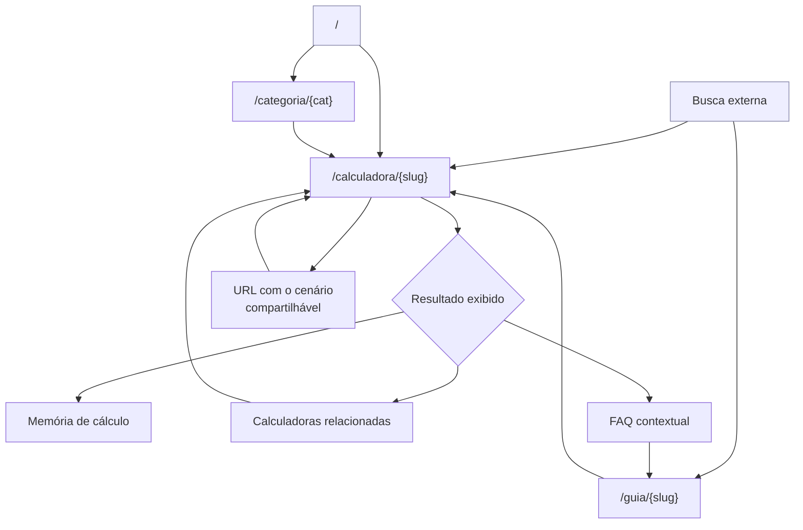

# Especificação de UX/UI

## 1. Princípios de design

1. **O resultado é o herói.** Nada compete com ele acima da dobra — nem marca, nem anúncio, nem explicação.
2. **A memória de cálculo é o produto, não um detalhe.** Precisa parecer feita com cuidado, não gerada por dump de dados.
3. **Densidade sóbria.** O público chega ansioso. Cor forte, animação e ênfase gratuita aumentam a ansiedade.
4. **Nada pula.** Layout estável do primeiro pixel ao último. É requisito de produto (`RNF-002`), não capricho.
5. **Mobile é o padrão, não a adaptação.** A maioria das sessões nasce no celular, em contexto de urgência.

## 2. Design tokens

### 2.1 Cor

Paleta sóbria, com um único acento. Valores como referência de intenção; a implementação usa a escala do sistema de estilo.

| Token | Uso |
|---|---|
| `surface` | Fundo da página |
| `surface-raised` | Cartões, bloco de resultado |
| `surface-sunken` | Fundo da memória de cálculo — distingue "conta" de "resultado" |
| `border` | Divisórias e contorno de campo |
| `text-primary` | Texto principal |
| `text-secondary` | Rótulos, legendas, vigência |
| `accent` | Um único azul, para foco, links e valor de destaque |
| `positive` | Verbas a receber, no detalhamento |
| `negative` | Descontos, no detalhamento |
| `warning-surface` | Fundo dos avisos de estimativa e de dado desatualizado |

**Regras.** Cor nunca é o único portador de informação: crédito e débito também são distinguidos por sinal e por rótulo. Contraste mínimo de 4,5:1 para texto e 3:1 para contorno de campo. Tema claro no v1; a paleta é definida por variável, de modo que o tema escuro não exija refatoração.

### 2.2 Tipografia

| Token | Uso | Observação |
|---|---|---|
| `font-sans` | Interface e texto | Uma família apenas |
| `font-mono` | **Valores dentro da memória de cálculo** | Alinhamento vertical de dígitos é o que torna a conta conferível |
| `text-display` | Valor do resultado principal | Maior elemento da página |
| `text-h1` a `text-h3` | Hierarquia de títulos | — |
| `text-body` | Corpo | Mínimo 16px, para evitar zoom automático em campo no iOS |
| `text-small` | Legenda, vigência, aviso | Nunca abaixo de 14px |

A escolha de fonte monoespaçada na memória de cálculo é funcional: colunas de valores desalinhadas são ilegíveis para conferência.

### 2.3 Espaçamento, raio e elevação

Escala de espaçamento em múltiplos de 4px. Raio pequeno para campos e botões, médio para cartões. Elevação usada com parcimônia: apenas no bloco de resultado, para separá-lo do formulário. Sem sombra em cartões de listagem.

### 2.4 Breakpoints

| Nome | Largura | Layout |
|---|---|---|
| `base` | < 640px | Coluna única. Padrão de projeto |
| `sm` | ≥ 640px | Coluna única mais larga |
| `md` | ≥ 768px | Formulário e resultado lado a lado quando couber |
| `lg` | ≥ 1024px | Conteúdo centralizado, largura máxima de leitura |

### 2.5 A grade da página

**Uma largura de página para todas as rotas**, definida em `src/lib/layout.ts` e usada por cabeçalho, rodapé e todo `main`. A coluna de leitura é limitada **dentro** dela, alinhada à esquerda.

As duas exigências de `lg` acima são de níveis diferentes, e é isso que permite atendê-las juntas: a **página** é centralizada; o que respeita a **medida de leitura** é a coluna de texto dentro dela. Centralizar também a coluna reproduz o desalinhamento.

> **Isto entrou em 08/08/2026 corrigindo um defeito visível.** Cada rota escolhia a própria largura à mão — home em `6xl`, calculadora em `5xl`, `/guias` em `4xl`, guia e as cinco legais em `3xl` —, enquanto cabeçalho e rodapé ficavam sempre em `6xl`. Medido em 1280 px: o logotipo começava em `x = 77` e o título de `/contato` em `x = 269`. **Cento e noventa e dois pixels**, em cinco rotas, e o site parecia quatro modelos costurados.
>
> Nada acusava porque não havia o que acusar: quatro números soltos em quatro arquivos não formam uma regra que se possa quebrar. Agora formam.
>
> **Em telefone nada mudou, e isso é verificável:** abaixo de 1152 px nenhum `max-w-*` chega a valer, e o `px-5` já era o mesmo em todas as rotas.

## 3. Biblioteca de componentes

| Componente | Papel | Notas |
|---|---|---|
| `CampoMonetario` | Entrada de valor | Máscara pt-BR; teclado decimal; valor interno em centavos |
| `CampoData` | Entrada de data | Máscara + seletor nativo |
| `CampoInteiro` | Contagem | Botões de incremento com área de toque de 44px |
| `CampoSelecao` | Escolha | Nativo no mobile |
| `SeletorVigencia` | Data de referência | Exibe o intervalo disponível |
| `BlocoResultado` | Resultado principal | Valor em destaque + detalhamento + aviso |
| `LinhaDetalhamento` | Verba ou desconto | Rótulo, valor, sinal |
| `MemoriaCalculo` | O diferencial | Detalhado em §4 |
| `EtapaCalculo` | Linha da memória | Rótulo, fórmula, parâmetro, resultado |
| `CitacaoParametro` | Valor + vigência + fonte | Reutilizado em toda a memória |
| `AvisoEstimativa` | Aviso de §1.6 de `03-functional-spec` | Sempre visível com o resultado |
| `SlotAnuncio` | Anúncio | Altura reservada por CSS antes de qualquer carregamento |
| `CartaoCalculadora` | Item de listagem | Nome + uma linha |
| `BuscaCatalogo` | Busca local | Sem rede |
| `FAQ` | Perguntas | Acordeão acessível |
| `Estado` | Vazio, pendente, erro | Estados de §1.5 |

## 4. Anatomia da memória de cálculo

O componente que carrega a tese do produto.

**Recolhida.** Acionador com largura total, sob o resultado: "Ver como este valor foi calculado" — com afordância clara de expansão. Não é um link discreto; é um convite.

**Expandida:**

```
┌─────────────────────────────────────────────┐
│ Como chegamos a este valor                  │
│ Parâmetros vigentes em {periodo}            │
├─────────────────────────────────────────────┤
│ 1. Base de contribuição previdenciária      │
│    Salário bruto                            │
│    = R$ 4.500,00                            │
├─────────────────────────────────────────────┤
│ 2. Contribuição — 1ª faixa                  │
│    R$ 1.621,00 × 7,50%                      │
│    Parâmetro: faixa 1 · vigência {periodo}  │
│    Fonte: {norma} ↗                         │
│    = R$ 121,58                              │
├─────────────────────────────────────────────┤
│ ... demais etapas ...                       │
├─────────────────────────────────────────────┤
│ Resultado: R$ 4.106,80                      │
│ Fontes: {lista de normas}                   │
└─────────────────────────────────────────────┘
```

**Regras do componente:**

| # | Regra |
|---|---|
| MC-1 | Etapas numeradas em ordem de execução, sem agrupamento que esconda passo |
| MC-2 | Fórmula com os valores já substituídos, não em notação algébrica |
| MC-3 | Toda etapa que usa parâmetro legal exibe `CitacaoParametro` |
| MC-4 | Valores em fonte monoespaçada, alinhados à direita |
| MC-5 | Nenhum anúncio dentro do bloco, em nenhuma circunstância |
| MC-6 | Expandir não recarrega nem recalcula: o traço já está em memória |
| MC-7 | Deve ser legível quando impressa ou capturada em tela — sem depender de interação |
| MC-8 | Valores exibidos idênticos aos do detalhamento; divergência de arredondamento entre os dois é defeito |

## 5. Estados por tela

| Estado | Aparência | Onde |
|---|---|---|
| Vazio | Área de resultado com altura reservada e mensagem convidativa | Toda calculadora |
| Pendente | Lista dos campos faltantes, sem número parcial | Toda calculadora |
| Esqueleto | Blocos cinza com a forma do resultado; apenas se exceder 200ms | Raro, por `RNF-005` |
| Calculado | Resultado + detalhamento + aviso + memória disponível | — |
| Erro de campo | Mensagem junto ao campo, contorno de erro, ícone; resultado limpo | — |
| Erro de vigência | Mensagem no lugar do resultado, formulário preservado | — |
| Erro inesperado | Mensagem de `03-functional-spec` §1.5, com link para contato | — |
| Sem resultado na busca | Mensagem + link para o catálogo completo | Home |
| Rota inexistente | Busca + calculadoras mais acessadas | 404 |

**Regra transversal.** Toda área que pode conter conteúdo dinâmico tem altura mínima reservada. Nenhum estado empurra o que está abaixo.

## 6. Acessibilidade

Meta: WCAG 2.1 AA nas rotas de calculadora (`RNF-008`).

| Aspecto | Requisito |
|---|---|
| Foco | Sempre visível, com contorno de contraste 3:1; nunca removido |
| Ordem de tabulação | Segue a ordem visual; sem armadilha de foco |
| Rótulos | Todo campo com rótulo associado; sem rótulo apenas por texto de exemplo |
| Erros | Vinculados ao campo por descrição acessível; anunciados ao surgir |
| Resultado | Região dinâmica cortês — anuncia sem interromper a digitação |
| Memória de cálculo | Acionador com estado de expansão anunciado; etapas como lista ordenada |
| Área de toque | Mínimo 44 × 44px |
| Contraste | 4,5:1 texto, 3:1 contorno |
| Zoom | Até 200% sem perda de funcionalidade nem rolagem horizontal |
| Movimento | Respeita preferência de movimento reduzido |
| Idioma | `lang="pt-BR"` |
| Estrutura | Um `h1` por página; hierarquia sem salto de nível |

**Ponto de atenção específico.** O anúncio é o elemento com maior probabilidade de quebrar acessibilidade — armadilha de foco, contraste ruim, movimento. Ele fica em contexto isolado, fora da ordem de tabulação principal, e o teste de navegação por teclado deve percorrer a página inteira **com o anúncio carregado**, não apenas sem ele.

## 7. Microcopy — princípios

| Princípio | Faça | Não faça |
|---|---|---|
| Estimativa, nunca direito | "Estimativa com base nos dados informados" | "Você tem direito a receber" |
| Segunda pessoa direta | "Preencha este campo" | "O usuário deve preencher" |
| Termo do usuário, não da norma | "Salário bruto mensal" | "Remuneração base de incidência" |
| Erro explica a saída | "A data final precisa ser posterior à data inicial." | "Data inválida." |
| Sem exclamação | "Pronto." | "Pronto!" |
| Sem culpar | "Não conseguimos concluir este cálculo." | "Você preencheu errado." |

Textos finais completos em `03-functional-spec` §1.4, §1.6 e §5.

## 8. Fluxo de navegação



**Legenda.** A entrada dominante é a busca externa direto na calculadora — a home não é o ponto de partida típico. Consequência: **toda página de calculadora precisa funcionar como página de chegada**, com contexto suficiente para alguém que nunca viu o site.

## 9. Posicionamento do anúncio

| Regra | Justificativa |
|---|---|
| Um único slot por página | Densidade é o que degradou o mercado atual |
| Sempre abaixo do resultado e do aviso de estimativa | O resultado é o herói (princípio 1) |
| Nunca dentro da memória de cálculo (MC-5) | O bloco que sustenta a confiança não é espaço comercial |
| Altura reservada antes do carregamento | `RNF-002` |
| Sem intersticial, sobreposição, fixação ou expansão automática | Todos causam deslocamento ou bloqueiam a leitura |
| Rotulado como publicidade | Distinção clara entre conteúdo e anúncio |
| Nada carrega antes do consentimento | `RF-009` |

**Conflito reconhecido.** Estas regras reduzem a receita por página em relação à prática do mercado. É uma escolha deliberada: a densidade de anúncio é justamente o que o produto se propõe a não repetir. Se HIP-03 for refutada, a decisão correta é revisar o modelo de receita — não afrouxar estas regras uma a uma até virar o concorrente.
