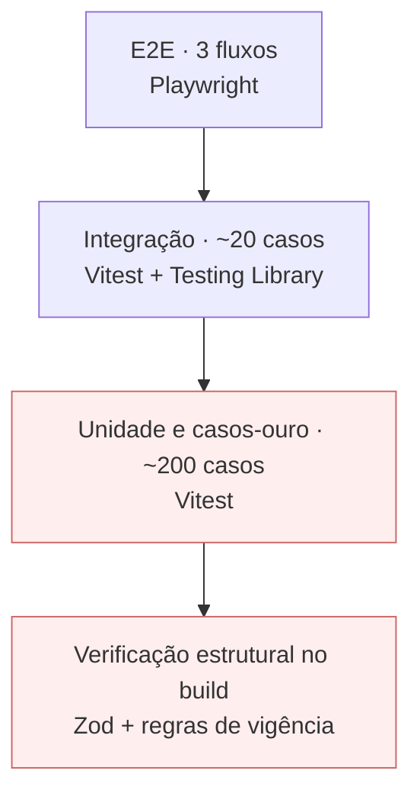

# Plano de Testes

> **Documento crítico.** A correção do cálculo é o produto. Um resultado errado publicado em escala é o único dano irreversível que este projeto pode causar, e nenhuma outra qualidade compensa.

## 1. Estratégia

Pirâmide deliberadamente desbalanceada: **peso máximo na base**, porque é onde mora o risco.

**Justificativa da forma.** Um defeito de interface produz uma sessão ruim. Um defeito no motor produz milhares de números errados que as pessoas levam para conversas com o empregador. Os dois níveis destacados são bloqueadores absolutos de deploy.

## 2. Ferramentas

| Nível | Ferramenta | Executa em |
|---|---|---|
| Estrutural | Zod + verificações customizadas | Build |
| Unidade e casos-ouro | Vitest | CI e local |
| Integração de componentes | Vitest + Testing Library | CI |
| Ponta a ponta | Playwright | CI |
| Acessibilidade | Verificador automatizado + roteiro manual | CI e pré-lançamento |
| Performance | Auditoria automatizada + orçamento no CI | CI |
| Vazamento de dado | Playwright com interceptação de rede | CI |

## 3. Casos-ouro — o núcleo do plano

### 3.1 Definição

Um caso-ouro é um cenário cujo resultado esperado foi **conferido manualmente contra fonte oficial**, e não contra outro software.

**Regra CO-1 (de `05-data-model`).** O valor esperado precisa ter uma destas origens, declarada em `fonte_verificacao`:

1. Cálculo manual conferido contra o texto da norma, com a memória do cálculo manual registrada;
2. Exemplo numérico publicado em fonte oficial;
3. Holerite ou termo de rescisão real, anonimizado, com autorização.

**Origem proibida:** resultado de site concorrente, de software de terceiro ou de resposta gerada por modelo de linguagem. É como o erro se propaga no mercado atual, e adotá-lo importaria o defeito que o produto existe para corrigir.

### 3.2 Estrutura

Cada caso-ouro é um registro versionado, conforme `ENT-006`, contendo: identificador, calculadora, **data de referência explícita**, entradas, saída esperada e fonte de verificação.

**A data de referência é sempre explícita.** Caso-ouro que dependa da data atual passa a falhar sozinho na virada do exercício, e a equipe aprende a ignorar falha — que é como suítes de teste morrem.

### 3.3 Cobertura mínima por calculadora

| Categoria de caso | Quantidade mínima | O que cobre |
|---|---|---|
| Faixa de parâmetro | 1 por faixa | Cada faixa de INSS e de IRRF isoladamente |
| Fronteira de faixa | 2 por fronteira | Um centavo abaixo e um centavo acima |
| Teto e piso | 2 | Teto previdenciário; salário mínimo |
| Isenção | 2 | Limite da isenção e um centavo acima |
| Redutor por faixa, quando houver | 3 | Início, meio e fim do intervalo de redução (`RN-013`) |
| Proporcionalidade | 4 | 1 avo, 11 avos, 12 avos, fracionamento de 15 dias (`RN-015`) |
| Modalidade | 1 por modalidade | Cada tipo de rescisão |
| Vigência anterior | 3 | O mesmo cenário em exercícios diferentes deve produzir resultados diferentes |
| Degenerado | 3 | Zero, valor mínimo, valor máximo |

Estimativa: **150 a 220 casos-ouro** para as dez calculadoras do v1.

### 3.4 Casos de fronteira obrigatórios

| ID | Cenário | Verifica |
|---|---|---|
| TC-001 | Salário exatamente no limite superior da 1ª faixa previdenciária | `RN-008` |
| TC-002 | Salário um centavo acima desse limite | `RN-008`, transição de faixa |
| TC-003 | Salário exatamente no teto previdenciário | `RN-009` |
| TC-004 | Salário muito acima do teto | `RN-009`, limitação |
| TC-005 | Rendimento no limite da isenção do imposto | `RN-013`, `RN-014` |
| TC-006 | Rendimento um centavo acima do limite da isenção | `RN-013` |
| TC-007 | Rendimento no limite superior do intervalo de redução | `RN-013` |
| TC-008 | Cálculo que resultaria em imposto negativo | `RN-014` — resultado é zero |
| TC-009 | Comparação entre desconto simplificado e deduções legais, com o simplificado mais favorável | `RN-012` |
| TC-010 | Mesmo cenário de TC-009, com as deduções legais mais favoráveis | `RN-012`, escolha correta |
| TC-011 | Período de exatamente 15 dias no mês | `RN-015` — conta como avo |
| TC-012 | Período de exatamente 14 dias no mês | `RN-015` — não conta |
| TC-013 | Rescisão com aviso indenizado cruzando a virada do mês | `RN-019` — projeção |
| TC-014 | Contrato com mais anos completos do que o limite do aviso proporcional | `RN-020` — limite máximo |
| TC-015 | Pedido de demissão sem cumprimento de aviso | `RN-018` — desconto, não crédito |
| TC-016 | Data de referência anterior à menor vigência cadastrada | `RN-003` — bloqueio, não extrapolação |
| TC-017 | Data de referência posterior à maior vigência com fim definido | `RN-003` |
| TC-018 | Mesmo cenário em duas vigências distintas | `RF-004` — resultados diferentes e ambos corretos |
| TC-019 | Valor cuja apuração produz fração de centavo | `RN-006`, `RN-007` |
| TC-020 | Cálculo de horas extras com jornada não padrão | `RN-024` — divisor correto |

## 4. Verificações estruturais no build

Executadas antes de qualquer teste. Falha aqui interrompe tudo.

| ID | Verificação | Regra |
|---|---|---|
| BV-01 | Todo parâmetro tem vigência, fonte e URL | `RN-001` |
| BV-02 | Nenhuma sobreposição de vigência do mesmo parâmetro | `RN-002`, V-1 |
| BV-03 | No máximo uma vigência aberta por parâmetro | V-3 |
| BV-04 | `fim` posterior a `inicio` | V-2 |
| BV-05 | Faixas contíguas, sem lacuna nem sobreposição | FX-1, FX-2 |
| BV-06 | Formato de `valor` corresponde ao tipo do parâmetro | V-4 |
| BV-07 | URL de fonte em domínio oficial | Regra F-1 |
| BV-08 | Toda calculadora tem cobertura de vigência para todos os parâmetros exigidos | C-1 |
| BV-09 | Todo caso-ouro declara `fonte_verificacao` não vazia | CO-1 |
| BV-10 | Nenhum literal monetário fora do motor de parâmetros | `RN-001` — regra de análise estática |
| BV-11 | Nenhuma operação de ponto flutuante sobre valor monetário | `RN-005` — análise estática |
| BV-12 | Mensagem de commit de parâmetro no formato exigido | `05-data-model` §5 |

**BV-10 e BV-11 são as regras mais valiosas desta tabela.** Elas impedem, mecanicamente, as duas formas mais prováveis de erro se infiltrar: uma constante escrita direto no código e uma conta feita em ponto flutuante.

## 5. Testes de integração de componente

| ID | Cenário | Requisito |
|---|---|---|
| TC-021 | Preencher formulário completo dispara cálculo sem botão | `RF-005` |
| TC-022 | Campo obrigatório vazio mantém estado pendente sem número parcial | §1.5 |
| TC-023 | Entrada inválida limpa o resultado anterior | §1.2 |
| TC-024 | Alterar data de referência recalcula e atualiza a memória | `RF-004` |
| TC-025 | Memória expandida contém uma etapa por passo do traço | `RF-003`, MC-1 |
| TC-026 | Toda etapa com parâmetro exibe vigência e link de fonte | `RN-029`, MC-3 |
| TC-027 | Valores da memória idênticos aos do detalhamento | MC-8 |
| TC-028 | Estado do formulário reflete na query string | `RF-006` |
| TC-029 | Abrir URL com query reproduz o mesmo resultado | `RF-006` |
| TC-030 | Query com valor inválido cai no padrão e avisa | `06-api-spec` §2.3 |
| TC-031 | Página com query recebe `noindex` | `07-security` §4.3 |
| TC-032 | Aviso de estimativa presente sempre que há resultado | `RN-028` |
| TC-033 | FGTS sem saldo informado exibe o aviso adicional | `RN-023` |
| TC-034 | Campos condicionais aparecem e somem conforme a regra | §3 |
| TC-035 | Falha da fonte externa mantém a página funcional com valor em cache | `RN-032` |
| TC-036 | Valor em cache com mais de 30 dias exibe aviso | `RN-033` |

## 6. Testes de ponta a ponta

Apenas três fluxos, escolhidos por serem os que, se quebrarem, tornam o produto inútil.

| ID | Fluxo | Passos |
|---|---|---|
| TC-037 | **Conferir o holerite** | Chegar em salário líquido → preencher → ver resultado → expandir memória → seguir link de fonte |
| TC-038 | **Estimar rescisão e compartilhar** | Chegar em rescisão → preencher → ver detalhamento → copiar URL → abrir em contexto novo → confirmar reprodução |
| TC-039 | **Calcular período anterior** | Abrir calculadora → alterar vigência → confirmar mudança de resultado e de parâmetro exibido → tentar data sem cobertura → confirmar bloqueio |

Executados em um navegador desktop e um mobile, com e sem consentimento de anúncio.

## 7. Teste de não vazamento de dado

**O teste mais importante depois dos casos-ouro.** Implementa o controle C-07 de `07-security`.

| ID | Cenário | Critério de falha |
|---|---|---|
| TC-040 | Preencher todas as calculadoras com valores marcadores únicos e interceptar todo o tráfego de saída | **Falha se qualquer marcador aparecer** em qualquer requisição |
| TC-041 | Provocar erro no motor e inspecionar o envio à ferramenta de erro | Falha se contiver valor de campo ou query string |
| TC-042 | Verificar evento de análise | Falha se contiver algo além de identificador de calculadora e tipo de interação — **exceto** `busca_sem_resultado`, que pode conter o termo buscado e apenas ele (`RN-031.1`) |
| TC-043 | Repetir TC-040 **com o anúncio carregado e consentido** | Mesmo critério |

**Escopo dos marcadores em TC-040 e TC-043.** Os valores marcadores são semeados **apenas nos campos de formulário das calculadoras**, nunca no campo de busca do catálogo. Semear o campo de busca faria o teste reprovar `busca_sem_resultado`, que é comportamento especificado — e um teste bloqueador que reprova comportamento correto é um teste que alguém acaba marcando como pendente, o que `CLAUDE.md` proíbe.

**Limite da exceção.** TC-042 deve verificar ativamente que `busca_sem_resultado` é o **único** evento com carga variável. Um segundo evento transmitindo entrada do usuário reprova o teste, independentemente de quão inofensivo pareça: a exceção de `RN-031.1` é exaustiva por construção, e é assim que ela não vira precedente.

**TC-043 executa a cada deploy e a cada mudança de configuração de anúncio.** É o único mecanismo que detecta a ameaça AM-02 antes do usuário.

## 8. Acessibilidade

| ID | Verificação | Como |
|---|---|---|
| TC-044 | Zero violação automatizada de nível A e AA nas rotas de calculadora | Automatizado no CI |
| TC-045 | Fluxo completo apenas por teclado, com anúncio carregado | Manual, pré-lançamento |
| TC-046 | Resultado anunciado por leitor de tela ao ser atualizado | Manual, pré-lançamento |
| TC-047 | Memória de cálculo navegável e compreensível por leitor de tela | Manual, pré-lançamento |
| TC-048 | Zoom a 200% sem rolagem horizontal | Automatizado |

## 9. Performance

| ID | Meta | Requisito | Gate |
|---|---|---|---|
| TC-049 | LCP ≤ 2,0s | `RNF-001` | Bloqueia deploy |
| TC-050 | CLS ≤ 0,05 **com anúncio carregado** | `RNF-002` | Bloqueia deploy |
| TC-051 | JavaScript por rota ≤ 120 KB comprimido | `RNF-004` | Bloqueia deploy |

**TC-051 passou a medir no T-106.** Do T-003 até o T-105 o passo era um `echo` justificado por "ainda não há rota de calculadora" — havia desde o T-103, e o `echo` continuou passando. `scripts/verificar-orcamento.ts` soma o JavaScript comprimido de cada rota a partir do manifesto do build e falha se uma rota de calculadora ultrapassar o teto. Avisa, sem falhar, quando a folga cai abaixo de 8 kB.

| TC-052 | Cálculo ≤ 50ms | `RNF-005` | Alerta |
| TC-053 | Funciona integralmente com terceiros bloqueados | `RNF-007` | Bloqueia deploy |

Não há teste de carga. O produto é estático e o cálculo roda no cliente: não existe recurso de servidor a saturar. Testar carga aqui seria otimização antes de medição.

## 10. Critérios de bloqueio

| Nível | Bloqueia o quê |
|---|---|
| Verificações estruturais BV-01 a BV-12 | Build inteiro |
| Casos-ouro — 100% dos casos | Deploy |
| Cobertura de ramos do motor ≥ 90% (`RNF-011`) | Deploy |
| TC-040 a TC-043 — vazamento | Deploy |
| TC-049 a TC-051, TC-053 — performance | Deploy |
| TC-044 — acessibilidade automatizada | Deploy |
| Integração e E2E | Deploy |
| Verificações manuais | Lançamento e release |

**Regra absoluta.** Nenhum caso-ouro é marcado como pendente para desbloquear entrega. Se um caso-ouro falha, ou o código está errado, ou o caso está errado — e descobrir qual é o trabalho, não contorná-lo.

## 11. Auditoria periódica de parâmetros

Testes verificam que o código faz o que os parâmetros dizem. **Nenhum teste verifica se os parâmetros estão certos.** Isso é auditoria humana e é a atividade mais importante da manutenção.

| Aspecto | Definição |
|---|---|
| Frequência | Trimestral, e obrigatoriamente a cada virada de exercício |
| Escopo | Todo parâmetro com vigência aberta |
| Método | Abrir a fonte oficial declarada, conferir valor a valor, registrar a conferência |
| Registro | Entrada em `17-changelog`, mesmo quando nada muda — "auditado, sem divergência" é informação |
| Divergência encontrada | Procedimento de §6 de `05-data-model` + incidente em `15-runbook` |
| Meta | Zero divergência (`M-3`) |

**Regra de conferência.** A conferência é feita contra a fonte oficial declarada em `Fonte.url`. Se essa URL estiver morta, o trabalho da auditoria inclui localizar a fonte vigente e atualizar o registro — link quebrado invalida a promessa de `RF-003` tanto quanto um valor errado.

## 12. Dados e ambiente de teste

Não há banco nem dado sensível a mascarar. Os dados de teste são os casos-ouro e valores marcadores para TC-040.

| Ambiente | Uso |
|---|---|
| Local | Desenvolvimento; todos os testes exceto os manuais |
| CI | Suíte completa a cada commit; bloqueadores ativos |
| Produção | Verificações manuais de acessibilidade e Web Vitals reais |

Não há ambiente de homologação. Com produto estático, sem banco e sem migração, um estágio intermediário adicionaria manutenção sem reduzir risco — o risco real está no parâmetro, e ele é verificado no build, não no ambiente.

## 13. Lista de verificação pré-lançamento

- [ ] Suíte completa verde, sem caso pendente
- [ ] Auditoria de parâmetros concluída, com registro no changelog
- [ ] TC-045 a TC-047 executados manualmente
- [ ] TC-043 executado com o anúncio real em produção
- [ ] Métricas de `RNF-001` a `RNF-004` verificadas em produção
- [ ] Cada uma das dez calculadoras exercitada manualmente com um caso real
- [ ] Cada link de fonte na memória de cálculo aberto e confirmado
- [ ] Páginas legais revisadas
- [ ] Sitemap submetido, `robots.txt` conferido
- [ ] Restauração do repositório testada a partir de cópia limpa
- [ ] `15-runbook` revisado contra o ambiente real
