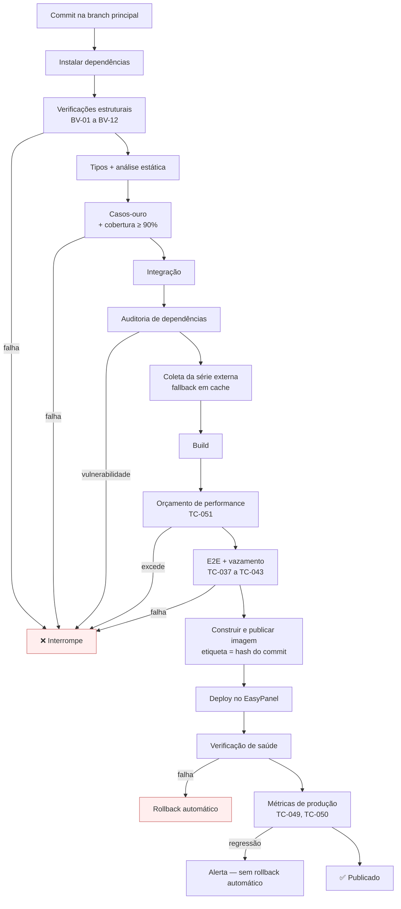

# Deploy e Operação

## 1. Ambientes

| Ambiente | Onde | Propósito |
|---|---|---|
| Local | Máquina do mantenedor | Desenvolvimento e testes |
| CI | Executor da automação | Verificação; produz a imagem |
| Produção | VPS + EasyPanel | Público |

**Não há homologação.** Justificativa em `12-test-plan` §12: sem banco e sem migração de estado, o risco real está no parâmetro legal, verificado no build. Um ambiente intermediário adicionaria manutenção sem reduzir o risco dominante.

**Gatilho para criar homologação:** introdução de banco de dados, autenticação ou qualquer estado persistido — ou seja, reversão de `ADR-002`.

## 2. Estrutura do repositório

```
.
├── CLAUDE.md
├── README.md
├── BACKLOG.md
├── .env.example
├── Dockerfile
├── docker-compose.yml
├── docs/
├── src/
│   ├── app/                  # rotas
│   ├── components/
│   ├── content/              # MDX: guias e FAQ
│   └── lib/
│       ├── engine/           # motor de cálculo — zero dependência de runtime
│       ├── params/           # parâmetros legais por vigência
│       └── format/           # formatação pt-BR (fora do motor)
├── tests/
│   ├── golden/               # casos-ouro
│   ├── e2e/
│   └── leak/                 # TC-040 a TC-043
└── .github/workflows/
```

**Regra de fronteira.** `src/lib/engine/` não importa nada de `src/app/`, `src/components/` nem `src/lib/format/`. Verificado por análise estática. É o que mantém o motor puro e portável (`ADR-003`).

## 3. Contêiner

**Estratégia:** build em múltiplos estágios — instalação de dependências, build da aplicação, imagem final mínima com a saída autônoma do Next.js.

**Princípios:**

| # | Regra |
|---|---|
| D-1 | Imagem final não contém código-fonte, dependências de desenvolvimento nem histórico do repositório |
| D-2 | Processo roda como usuário sem privilégio |
| D-3 | Nenhum segredo embutido na imagem (`07-security` §6) |
| D-4 | Rota de verificação de saúde exposta |
| D-5 | Imagem etiquetada com o hash do commit, nunca apenas `latest` — é o que torna o rollback possível |

**Composição em produção:** dois serviços independentes — a aplicação e a ferramenta de análise com seu próprio banco. A aplicação não depende do segundo para funcionar.

## 4. Pipeline



**Ordem deliberada.** As verificações mais baratas e mais críticas vêm primeiro. Um parâmetro legal inválido interrompe o pipeline em segundos, antes de qualquer build.

**Assimetria de falha (regra R-3 de `06-api-spec`).** Falha da coleta da série externa **não** interrompe: prossegue com o valor em cache e registra aviso. Um parâmetro legal errado deve quebrar o build; um indicador econômico indisponível, não.

## 5. Variáveis de ambiente

| Variável | Ambiente | Segredo | Uso |
|---|---|---|---|
| `NEXT_PUBLIC_SITE_URL` | todos | não | Canônicas, sitemap |
| `NEXT_PUBLIC_AD_CLIENT_ID` | prod | não | Identificador público da rede de anúncio |
| `NEXT_PUBLIC_AD_SLOT_ID` | prod | não | Identificador do slot único (`10-ux-ui-spec` §9) |
| `NEXT_PUBLIC_CMP_ID` | prod | não | Plataforma de gestão de consentimento (INT-002) |
| `NEXT_PUBLIC_ANALYTICS_URL` | prod | não | Endereço da análise autohospedada |
| `NEXT_PUBLIC_ANALYTICS_SITE_ID` | prod | não | Identificador do site |
| `SENTRY_DSN` | prod | não | Registro de erro |
| `SENTRY_AUTH_TOKEN` | CI | **sim** | Envio de mapas de origem |
| `BCB_API_BASE_URL` | build | não | Endereço-base do serviço de séries temporais |
| `BCB_SERIES_ID` | build | não | Identificador da série econômica |
| `BCB_TIMEOUT_MS` | build | não | Tempo limite da coleta; 3000 por padrão (`06-api-spec` §4.2) |
| `DEPLOY_WEBHOOK_URL` | CI | **sim** | Disparo do deploy |
| `REGISTRY_TOKEN` | CI | **sim** | Publicação da imagem |
| `UMAMI_DATABASE_URL` | prod | **sim** | Banco da ferramenta de análise |
| `UMAMI_APP_SECRET` | prod | **sim** | Sessão da ferramenta de análise |
| `UMAMI_DB_USER` | prod | **sim** | Usuário do Postgres da análise |
| `UMAMI_DB_PASSWORD` | prod | **sim** | Senha do Postgres da análise |
| `VCS_REF` | CI | não | Hash do commit; vira etiqueta da imagem (D-5) |

**Regras.** Segredos vivem apenas no cofre do repositório e no painel do EasyPanel. `.env.example` contém nomes e comentários, nunca valores. Nenhuma variável prefixada como pública contém segredo — o prefixo torna o valor visível no navegador.

**Regra de sincronia.** Esta tabela e `.env.example` descrevem o mesmo conjunto e não podem divergir: variável que existe em um e não no outro é variável que alguém vai esquecer de configurar em produção. Ao adicionar uma, adicione nos dois no mesmo commit.

## 6. Migrações

**Não há migração de banco de dados na aplicação** (`ADR-002`).

Existe, porém, um conceito análogo que exige disciplina: **evolução do formato dos parâmetros**. Quando a estrutura de um parâmetro muda:

| # | Regra |
|---|---|
| MG-1 | A mudança é aplicada a todas as vigências, inclusive as encerradas — vigência antiga precisa continuar calculável (`RF-004`) |
| MG-2 | Os casos-ouro das vigências antigas devem continuar passando, com os mesmos valores esperados |
| MG-3 | Se um caso-ouro antigo muda de resultado, ou a mudança está errada ou o caso estava errado. Nunca ajustar o esperado para "passar" |
| MG-4 | Reversibilidade: reverter o commit restaura o formato anterior, porque não há estado externo a desfazer |

A ausência de banco transforma migração em refatoração — reversível por `git revert`, sem janela de manutenção.

## 7. Domínio, DNS e TLS

| Item | Definição |
|---|---|
| Domínio | **`calculoficial.com.br`** |
| DNS | Registro apontando para a VPS |
| TLS | Certificado automático via EasyPanel, com renovação automática |
| Redirecionamentos | Sem `www` para com `www`, ou o inverso — escolher um e manter; HTTP para HTTPS sempre |
| HSTS | Ativo após confirmar que o TLS está estável |

**Canônica.** `NEXT_PUBLIC_SITE_URL=https://calculoficial.com.br` em produção. O valor entra no build, não em runtime — o prefixo `NEXT_PUBLIC_` é substituído no bundle. Consequência prática: mudar o domínio exige rebuild, não apenas reconfigurar o painel.

> ⚠️ VERIFICAR: registrar o domínio e confirmar a titularidade **antes** de T-004. O nome do produto e o domínio foram definidos depois da fundação documental; nada no repositório prova que o registro existe.

> ⚠️ VERIFICAR: o nome "Cálculo Oficial" convive com o aviso de `03-functional-spec` §5, que declara que os resultados **não** constituem aconselhamento e não substituem profissional habilitado. Conferir com orientação jurídica se a marca exige reforço do aviso — por exemplo, torná-lo mais proeminente na home e no rodapé do que o previsto em `RF-010`. Registrado aqui para ser decisão, não descuido.

> ⚠️ VERIFICAR: confirmar a renovação automática do certificado **antes** do lançamento. Certificado expirado derruba o site inteiro e é uma das falhas mais comuns em VPS autogerida.

## 8. Backup

Ativos por criticidade:

| Ativo | Onde vive | Estratégia | Retenção |
|---|---|---|---|
| **Código e parâmetros** | Repositório remoto | Espelhamento em segundo repositório ou cópia local periódica | Histórico completo |
| Imagens de contêiner | Registro | Últimas 10 etiquetas preservadas | 10 versões |
| Configuração do EasyPanel | VPS | Exportação mensal para armazenamento externo | 6 cópias |
| Banco da ferramenta de análise | VPS | Cópia semanal para armazenamento externo | 4 cópias |
| Registros de servidor | VPS | Sem cópia | 30 dias |

**Ordem de importância.** O ativo insubstituível é o repositório: ele contém o motor, os parâmetros com suas fontes, os casos-ouro e o conteúdo. Perder a VPS custa uma tarde de reconstrução. Perder o repositório custa o projeto.

**Consequência.** O repositório remoto não é backup, é o original. Precisa existir uma segunda cópia independente do provedor.

### 8.1 Procedimento de restauração

**Deve ser testado antes do lançamento e a cada semestre.** Backup não testado não é backup.

| # | Passo | Verificação |
|---|---|---|
| 1 | Clonar o repositório em máquina limpa | Histórico íntegro |
| 2 | Instalar dependências e rodar a suíte completa | Tudo verde |
| 3 | Construir a imagem localmente | Build conclui |
| 4 | Provisionar contêiner em ambiente novo | Serviço sobe |
| 5 | Restaurar configuração do EasyPanel a partir da exportação | Rotas e TLS operantes |
| 6 | Restaurar o banco da análise a partir da cópia | Histórico presente |
| 7 | Repontar DNS | Site no ar |

**Meta de recuperação:** 4 horas para o site voltar ao ar; 24 horas para restaurar o histórico de análise. O histórico de análise é o único dado cuja perda é irreversível — e é aceitável.

## 9. Rollback

| Cenário | Ação | Tempo |
|---|---|---|
| Verificação de saúde falha após deploy | Automático: reimplanta a etiqueta anterior | < 2 min |
| Defeito descoberto após deploy bem-sucedido | Manual: reimplantar a etiqueta anterior pelo painel | < 5 min |
| **Parâmetro legal incorreto em produção** | **Corrigir para a frente**, não reverter — ver abaixo | Conforme `15-runbook` |
| Regressão de performance | Alerta, não rollback automático; avaliar e decidir | — |

**Por que parâmetro errado não é revertido.** Reverter restauraria o valor anterior, que também pode estar errado, e apagaria o registro da tentativa de correção. O procedimento correto é: corrigir com nova vigência ou com correção declarada, registrar no changelog, adicionar o caso-ouro que teria detectado, publicar (§6 de `05-data-model`).

## 10. Verificações de saúde

| Verificação | Frequência | Falha significa |
|---|---|---|
| Rota de saúde da aplicação | 30s | Container caiu; reinício automático |
| Página inicial retorna 200 | 1 min, monitoramento externo | Site fora; alerta imediato |
| Validade do certificado | Diária | Alerta com 14 dias de antecedência |
| Espaço em disco da VPS | Diária | Alerta em 80% |
| Idade do valor da série externa | Diária | Alerta acima de 30 dias (`RN-033`) |

O monitoramento de disponibilidade é **externo à VPS**. Monitoramento hospedado no mesmo servidor que monitora não detecta a queda desse servidor.

## 11. Lista de verificação de deploy

**Toda publicação:**
- [ ] Pipeline verde de ponta a ponta
- [ ] Etiqueta da imagem corresponde ao hash do commit
- [ ] Verificação de saúde passou após o deploy
- [ ] Página inicial e uma calculadora abertas manualmente

**Publicação que altera parâmetro legal:**
- [ ] Mensagem de commit no formato exigido, com fonte
- [ ] Fonte oficial aberta e conferida
- [ ] Casos-ouro da nova vigência adicionados
- [ ] Casos-ouro das vigências anteriores continuam passando (MG-2)
- [ ] Entrada registrada em `17-changelog`
- [ ] Cálculo de conferência executado em produção após o deploy
